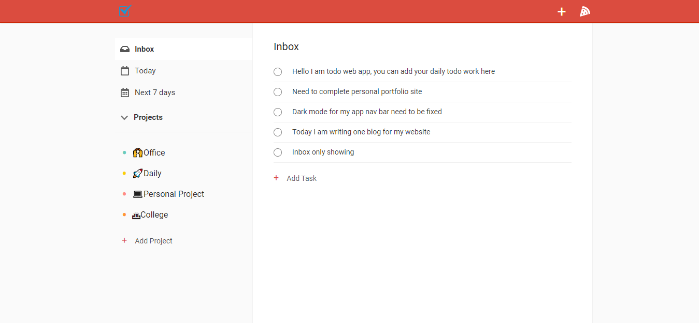

<h1>Todo App</h1>
<p>
In this repo, I am had created the popular <a href="https://todoist.com">Todoist</a> application using <b>create-react-app</b> as a base from scratch using React (Custom Hooks, Context), Firebase & React Testing Library (unit & integration testing). In addition to the latter technologies, I had styled the application using SCSS (CSS) and following the BEM naming methodology and I had to make sure that the application is fully responsive.
</p>

<h2>Screenshot</h2>


<h1>🛠 Installation & Set Up</h1>
#### 1. Install and use the correct version of Node
```
npm install
```

#### 2. Install dependencies

```
+ npm install --save-dev @testing-library/jest-dom

+ npm install --save-dev @testing-library/react

+ npm install @testing-library/user-event --save-dev

+ npm install --save firebase

+ npm install moment --save

+ npm install node-sass

+ npm install react react-dom

+ npm install react-icons --save
```

#### 3. Start the development server

```
npm start
```

# 🚀HappyCoding
